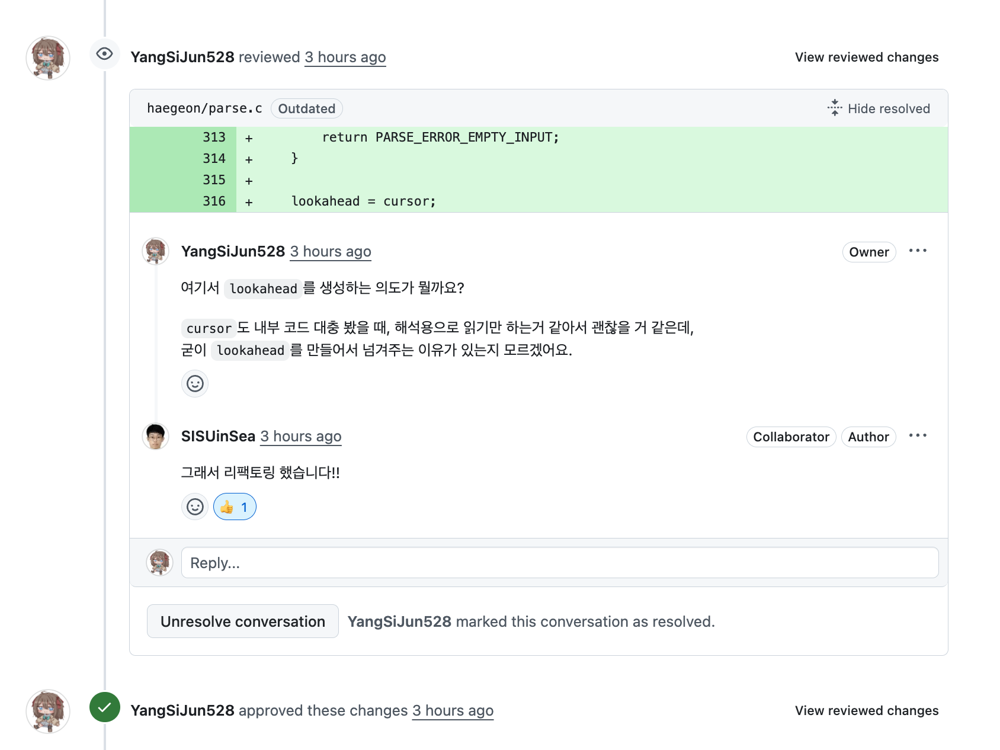
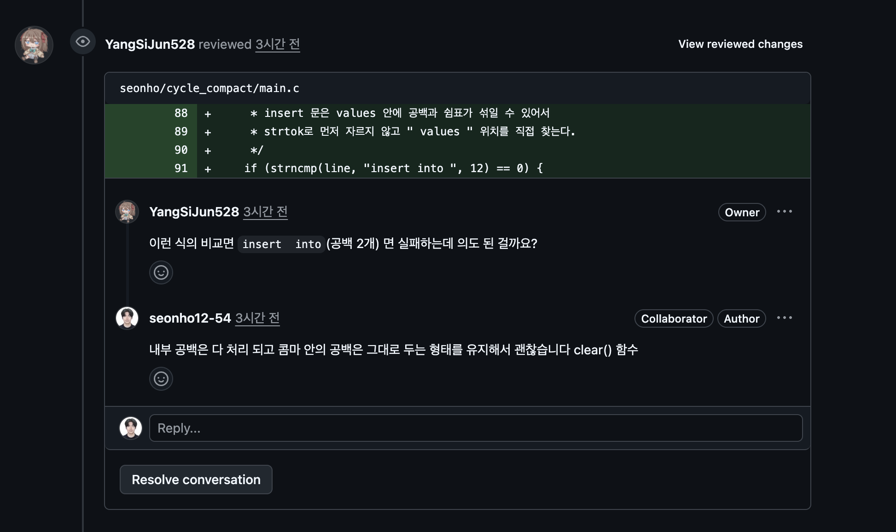
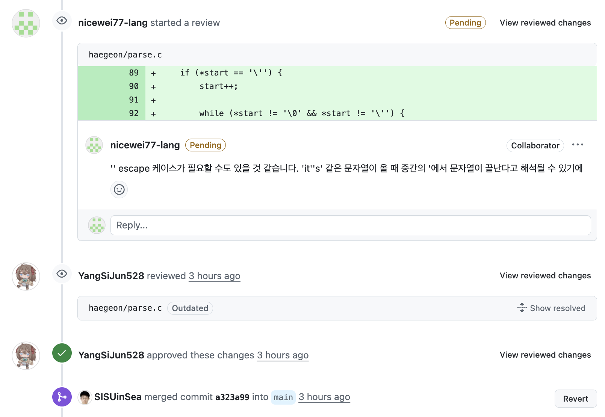
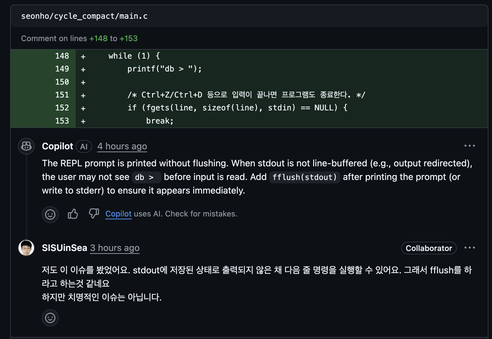

  

# 수요코딩회 발표 보고서

## 1. 한눈에 보기

| 항목 | 내용 |
| --- | --- |
| 주제 | AI를 빠르게 쓰는 것보다, AI를 어떻게 통제할 것인지 |
| 진행 방식 | 4명이 같은 주제를 각자 구현하고, 코드 리뷰와 프롬프트 로그 분석까지 함께 진행 |
| 핵심 질문 | 짧고 이해 가능한 코드, 좋은 프롬프트, 협업 리뷰의 실제 효용 |
| 한 줄 결론 | 시도 자체는 의미 있었으나, `각자 구현 + 전체 리뷰`는 예상보다 훨씬 큰 비용 |

## 2. 시연 + 구현 소개

> 작성 예정
>
> 실제 발표 직전에 데모 순서와 구현 설명 흐름에 맞춰 보완 예정

## 3. 협업 소개

이번 수요코딩회에서의 핵심 관심사는 `같이 AI를 써서 빨리 만든다`보다, `AI를 사람이 주도하면서 써볼 수 있을까`에 대한 실험이었음.

정리하면 아래와 같은 협업이었음.

- 같은 주제를 4명이 각자 구현
- 구현 결과를 서로 코드 리뷰
- 프롬프트 로그를 모아서 비교
- 어떤 방식이 더 통제 가능했는지 회고

즉, 이번 발표의 포인트는 기능 자랑보다 `AI를 다루는 방식 자체를 실험한 기록`에 가까움.

## 4. 기존의 문제점 인식

기존 방식에서 느낀 문제는 아래처럼 정리 가능했음.

### 4-1. AI 결과물이 금방 블랙박스가 됨

- 결과는 나오지만, 왜 이렇게 구현됐는지 설명이 어려움
- 코드가 조금만 길어져도 사람이 전체 흐름을 놓치기 쉬움
- 결국 "돌아가긴 하는데 이해는 잘 안 되는 코드"가 남기 쉬움

### 4-2. 결과물이 비슷해짐

- 큰 요구사항을 그대로 던지면 비슷한 프롬프트, 비슷한 코드, 비슷한 발표가 나옴
- 팀별 차이가 줄어들고, 서로에게서 배울 수 있는 포인트도 약해짐

### 4-3. 리뷰 비용을 쉽게 봄

- 코드가 짧을 줄 알고 시작했지만 실제로는 그렇지 않았음
- 내 코드도 봐야 하고 남의 코드도 봐야 해서 부담이 빠르게 커졌음
- 특히 초반에는 코드 자체를 이해하는 데 드는 인지 부하가 컸음

## 5. 목표

이번 시도의 목표는 아래 한 줄로 정리했음.

> AI를 통제하기 위해, 프롬프트를 더 잘 쓰고 사람이 이해 가능한 범위 안에서 개발

세부 목표는 다음과 같았음.

- 사람이 먼저 구조와 방향을 정함
- AI는 그 방향 안에서 구현을 돕는 도구로 활용
- 결과물뿐 아니라 프롬프트와 판단 과정도 기록
- 나중에 비교와 회고가 가능하도록 협업 흔적을 남김

## 6. 도전 시도

### 6-1. 짧은 코드로 각자 구현하고 코드 리뷰하기

이번에 가장 크게 시도한 실험은 `짧은 코드 + 각자 구현 + 코드 리뷰`였음.

선택 이유는 아래와 같았음.

- AI를 어떻게 쓰는지에 따라 결과물이 얼마나 달라지는지 확인 필요
- 코드가 짧다면 서로 읽고 리뷰하는 것도 가능하다는 판단
- 각자 구현하면 프롬프트 스타일과 설계 선택 차이가 더 잘 드러날 것이라는 기대

기대한 효과는 아래와 같았음.

- AI 사용 방식 비교
- 결과물 비교
- 리뷰를 통한 학습
- GitHub 협업 경험 축적

### 6-2. 프롬프트 로그 수집하고 분석하기

또 하나의 실험은 `프롬프트 로그 수집`이었음.

이 실험을 넣은 이유는 단순했음.

- 개선을 위해서는 측정 가능한 근거가 필요했음
- 어떤 요청이 좋았는지, 어떤 요청이 비효율적이었는지 기록이 필요했음
- 감으로 회고하지 않고 실제 기록을 바탕으로 이야기하고 싶었음

그래서 작업 과정에서 나온 프롬프트를 모아 아래 작업 진행.

- 서로 비교
- AI에게 다시 보여주고 피드백 확보

## 7. 진행 방식

전체 흐름은 `공부 -> 개발 -> 리뷰` 사이클이었음.

| 단계 | 한 일 |
| --- | --- |
| 공부 | 핵심 개념과 최소 명세 정리 |
| 개발 | 각자 작은 범위로 구현하면서 AI 사용 |
| 리뷰 | 코드와 프롬프트 로그를 비교하고 피드백 |

원래 의도는 단순 구현이 아니라 `이해`, `실험`, `회고`가 함께 남는 흐름의 구성임.

## 8. 결과 정리

### 8-1. 좋았던 점

- 새로운 협업 방식을 실제로 시도
- AI를 통제하려는 문제의식을 구체적인 방식으로 전환
- 좋은 프롬프트는 길이보다 `수정 대상`, `제약`, `성공 기준`이 중요하다는 점 확인
- 프롬프트 로그를 남겨서 회고의 근거 확보
- GitHub PR 리뷰 방식으로 협업해본 경험 축적

  
  

  
  

### 8-2. 아쉬웠던 점

- 생각보다 시간이 매우 오래 걸렸음
- 코드 레벨까지 충분히 이해하지 못한 상태에서 리뷰가 필요했음
- 리뷰에 드는 에너지를 과소평가했음
- 각자 따로 개발하고 다시 서로 리뷰하는 구조가 생각보다 무거웠음
- 초반 세팅과 GitHub 사용 방식에 익숙해지는 시간도 꽤 들었음

### 8-3. 특히 크게 드러난 한계

- `코드가 짧으면 리뷰도 쉽다`는 가정이 실제로는 잘 맞지 않았음
- 병렬 구현 시간이 길어질수록 서로의 맥락이 벌어졌음
- 후반부로 갈수록 `AI를 잘 써보자`보다 `일단 빨리 끝내자`가 더 커졌음

## 9. 후기

이번 시도는 완성된 방식이라기보다, `어디서 막히는지 직접 확인한 실험`에 가까웠음.

좋았던 쪽은 분명했음.

- AI의 문제를 막연하게 느끼는 데서 끝나지 않았음
- 직접 기록하고 비교하면서 개선 포인트를 찾을 수 있었음
- 프롬프트 로그를 보고 작업 내역과 연결해서 회고할 수 있었음

아쉬운 쪽도 분명했음.

- 따로 개발하는 부담이 컸음
- 남의 코드를 읽는 데 예상보다 훨씬 많은 에너지가 들었음
- 코드가 조금만 복잡해져도 리뷰 자체가 큰 일이 됐음

## 10. 개선점 후보

다음에 다시 한다면, 아래 방향이 더 현실적이라는 결론이었음.

### 10-1. 병렬 구현보다 대표 구현 중심으로 가기

- 명세는 같이 작성
- 구현은 한 명이 대표로 담당
- 나머지는 페어 혹은 리뷰 중심으로 참여

이 방식이 더 효율적인 이유는 아래와 같음.

- 구현 분산 축소
- 이해 맥락 공동 유지
- 리뷰 포인트 선명화

### 10-2. 페어 프로그래밍을 돌려가면서 해보기

- 드라이버와 내비게이터를 번갈아 담당
- 한 사람만 계속 구현하지 않도록 사이클마다 역할 교체
- 프롬프팅 경험도 돌아가면서 확보

이렇게 하면 각자 따로 멀어지는 시간보다, 같이 맥락을 공유하는 시간이 늘어남.

### 10-3. 시작 전에 최소 버전부터 뽑아보기

- 처음부터 끝까지 다 만들려고 들어가지 않음
- AI에게 `최소 기능만 남긴 가장 짧은 버전`을 먼저 요청
- 실제 코드 볼륨을 확인한 뒤 이번 범위 결정

이 단계 선행 시 기대 효과는 아래와 같음.

- 리뷰 가능한지
- 구현량이 감당 가능한지
- 어디까지가 핵심인지

### 10-4. 코드는 더 짧게, 리뷰 범위는 더 좁게

- 코드가 길어지는 것을 가장 큰 리스크로 인식
- 코어 기능만 남기고 나머지는 뒤로 미룸
- 리뷰도 전체 취약점 탐색보다 핵심 설계, 흐름, 명세 준수 여부 위주로 진행

### 10-5. 프롬프트 로그 수집은 유지하기

- 비용이 거의 없음
- 회고 자료로 바로 활용 가능
- AI에게 다시 피드백받는 용도로도 유용함

이 부분은 이번 방식에서 비교적 부담이 적고 효과가 좋았던 요소였음.

## 11. 결론

이번 수요코딩회는 `AI로 빨리 만드는 법`보다 `AI를 사람이 통제하면서 쓰는 법`을 실험한 시간이었음.

결과적으로 아래와 같은 결론.

- 시도 자체는 충분히 의미 있었음
- 다만 `각자 구현 + 전체 리뷰`는 비용이 너무 컸음
- 다음에는 구현은 더 집중시키고, 리뷰는 더 가볍고 선명하게 가져가는 편이 좋음

## 12. 참고 자료

- [수요코딩회 수요일 임시 회고](/Users/sijun-yang/Documents/GitHub/jungle-week6/수요코딩회 수요일 임시 회고.txt)
- [수요코딩회 6주차 수요일 임시회고 2](/Users/sijun-yang/Documents/GitHub/jungle-week6/수요코딩회 6주차 수요일 임시회고 2.txt)
- [Codex 프롬프트 사용 방식 비교 결과](/Users/sijun-yang/Documents/GitHub/jungle-week6/codex-prompt-comparison-report.md)
- [Codex 프롬프트 작성 피드백 요약](/Users/sijun-yang/Documents/GitHub/jungle-week6/codex-prompt-feedback-summary.md)
